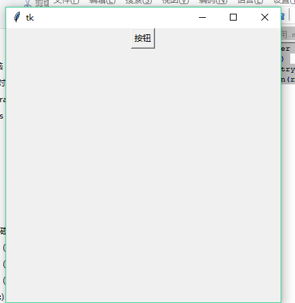

	vim tk01.py
	#!/usr/bin/python3

	from tkinter import *
	root = Tk()
	root.geometry('400x400')
	root.title('root')
	Label(root,text='hello python!').pack()
	t = TopLevel(root,width=20,height=10)
	t.title('sub win')
	Label(root,text='hello sub win').pack()
	mainloop()

	tkinter的使用
	标签的使用
	labelframe, toplevel, Frame
	按钮
	scale组件
	单选框和复选框
	布局
	输入框

	按钮的编写
	vim tk02.py
	#!/usr/bin/python3

	from tkinter import *
	root = Tk()
	root.geometry('400x400')
	b1 = Button(root,text='打印')
	b1.pack()
	mainloop()

	点击按钮的时候，是没有任何操作的，必须要指定点击这个按钮的时候要干什么

	1. command
	2. bind

	from tkinter import *
	
	def f1():
		global root
		l = Label(root,text='hello python!',font=('',20),fg='yellow')
		l.pack()

	root = Tk()
	root.geometry('400x400')
	b1 = Button(root,text='打印',command=f1)
	b1.pack(anchor=E)
	mainloop()

第二种方法：
	from tkinter import *
	
	def f1():
		global root
		l = Label(root,text='hello python!',font=('',20),fg='yellow')
		l.pack()

	root = Tk()
	root.geometry('400x400')
	b1 = Button(root,text='打印')
	b1.bind('<Button-1>',f1)
	b1.pack()
	mainloop()

各种属性的定义：

	from tkinter import *
	
	def f1():
		global root
		l = Label(root,text='hello python!',font=('',20),fg='yellow')
		l.pack()

	root = Tk()
	root.geometry('400x400')
	b1 = Button(root,text='打印')
	b1.bind('<Button-3>',f1)
	b1['width'] = 20
	b1['height'] = 5
	b1['bg'] = 'red'
	b1.pack()
	mainloop()

获取当前标签内的值：
	from tkinter import *

	def f1(xx):
		print(xx.widget['text'])

	root = Tk()
	root.geometry('400x400')
	b1 = Button(root,text='1')
	b1.bind('<Button-1>',f1)
	b1.pack()

	b2 = Button(root,text='2')
	b2.bind('<Button-1>',f1)
	b2.pack()
	
	b3 = Button(root,text='3')
	b3.bind('<Button-1>',f1)
	b3.pack()
	
	mainloop()

使用标签获取到不同值的方法：
	from tkinter import *

	def f1(xx):
		l = Label(root, textvariable=xx.widget['text'])

	root = Tk()
	root.geometry('400x400')
	b1 = Button(root, text='1')
	b1.bind('<Button-1>', f1)
	b1.pack()

	b2 = Button(root, text='2')
	b2.bind('<Button-1>', f1)
	b2.pack()

	b3 = Button(root, text='3')
	b3.bind('<Button-1>', f1)
	b3.pack()

	mainloop()

	另外一种方法：
	